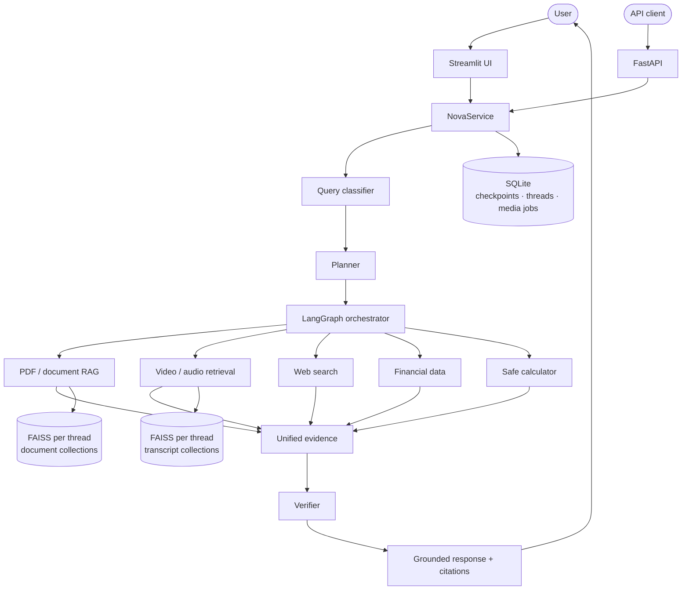
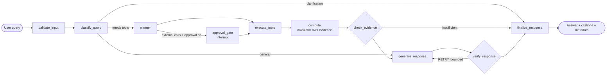
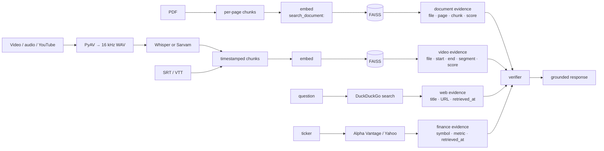

# Nova — Multimodal Agentic AI

Nova is a multimodal AI assistant designed to reason across documents, meeting recordings, web sources, and
financial data.

You upload a PDF or a meeting recording, or ask about a stock or a current event. Nova decides which sources it
needs, gathers evidence from them, writes an answer, and then checks that answer against the evidence before
showing it. Every claim it keeps is cited to a page, a time range in a recording, a URL, or a market-data
snapshot. If the evidence isn't there, it says so instead of guessing.

It is a production-oriented, single-node system: typed configuration, an HTTP API, structured logging,
tests and an evaluation harness. It runs locally by default (Ollama + faster-whisper on CPU). A hosted OpenAI-compatible model is a
configuration switch.

> **Origins.** Nova started from the CampusX [`chatbot-in-langgraph`](https://github.com/campusx-official/chatbot-in-langgraph)
> tutorial and from my earlier [`AI-Video-Assistant`](https://github.com/risitasutar/AI-Video-Assistant) project.
> What came from where is spelled out in [Engineering contributions](#engineering-contributions) and
> [Upstream attribution](#upstream-attribution).

---

## Contents

[Overview](#overview) · [Problem](#problem) · [Key capabilities](#key-capabilities) · [Architecture](#architecture) ·
[How the agent works](#how-the-agent-works) · [Multimodal pipeline](#multimodal-pipeline) · [RAG pipeline](#rag-pipeline) ·
[Evidence verification](#evidence-verification) · [Memory](#memory-architecture) · [Security](#security) ·
[Evaluation](#evaluation) · [API](#api) · [Streamlit](#streamlit-interface) · [Structure](#project-structure) ·
[Installation](#installation) · [Environment](#environment-variables) · [Running](#running-locally) ·
[Testing](#testing) · [Docker](#docker) · [Examples](#example-queries) · [Decisions](#engineering-decisions) ·
[Contributions](#engineering-contributions) · [Attribution](#upstream-attribution) · [Limitations](#limitations) ·
[Future work](#future-work)

## Overview

| | |
|---|---|
| **Agent** | An explicit LangGraph state machine: validate → classify → plan → (approve) → execute tools → compute → evidence gate → generate → verify → finalize |
| **Sources** | PDF documents · video/audio recordings (timestamped transcripts) · web and news search · market data · a safe calculator |
| **Models** | Ollama `qwen3:8b` + `nomic-embed-text` by default, or any OpenAI-compatible endpoint. faster-whisper locally (verified live); Sarvam for Hinglish (implemented, tested with mocked HTTP only) |
| **Evidence** | One evidence model for every source, with typed locators (page, time span, URL, symbol + retrieval time). Citations are rendered from those locators, never from model text |
| **Memory** | SQLite checkpoints per conversation thread; per-thread document and media indexes |
| **Interfaces** | Streamlit UI and a FastAPI service, both calling the same `NovaService` |
| **Quality** | 251 deterministic tests, 5 opt-in live tests, and two evaluation harnesses with saved per-case records |

## Problem

A chat model that "uses tools" is easy to demo and hard to trust. The tutorial this project started from was a
single ReAct loop: the model alone decided whether to search, the PDF retriever always returned four chunks
even when none were relevant, web results had no URLs, and nothing stopped the model from answering a document
question from memory. Asked about something the document did not contain, it often answered anyway.

Nova is my attempt to make each of those steps explicit, inspectable and testable:

- **Routing is a decision you can read**, not a side effect of a prompt.
- **Retrieval can come back empty**, and an empty result stops generation.
- **Every answer is checked** against the evidence that was actually retrieved.
- **Recordings are first-class sources**, with timestamps preserved from transcription to citation.

## Key capabilities

- **Query classifier** over 8 routes (`general`, `document`, `video`, `web`, `finance`, `calculation`,
  `multi_tool`, `clarification_required`): deterministic fast paths, structured LLM classification with a
  heuristic fallback, and policy guards (time-sensitive → live data; explicit document/recording references →
  retrieval; finance without a ticker → ask).
- **Planner** that turns the classification into tool steps; multi-tool requests get a validated LLM plan that
  cannot drop a source the router said was required.
- **Document RAG** with real page numbers, calibrated relevance threshold, hybrid rerank and corrective retry.
- **Video/audio retrieval**: Whisper or Sarvam transcription → timestamp-preserving chunks → FAISS → evidence
  cited as `[VIDEO: meeting.mp4, 12:23–14:06]`.
- **Meeting intelligence**: summary, decisions, action items and open questions, each item verified against
  the transcript chunk it cites.
- **Web and news search** (DuckDuckGo, keyless) with URLs kept for citation.
- **Finance tools**: quote, price history, return, volatility, max drawdown, SMA (Alpha Vantage or keyless
  Yahoo). Informational only, no advice.
- **Safe calculator**: an AST whitelist evaluator (no `eval`), also used to compute over retrieved figures.
- **Human-in-the-loop**: LangGraph `interrupt()` before external calls, resumable from the UI or the API.
- **Verifier**: citation validity, claim-to-source support, number checks, bounded retry, explicit
  insufficient-evidence responses.

## Architecture



The detailed diagrams (graph wiring, ingestion, temporal RAG, memory, deployment) are in
[`docs/architecture.md`](docs/architecture.md). The compiled LangGraph is exported to
[`docs/agent_graph.mmd`](docs/agent_graph.mmd).

## How the agent works

### How a query flows



1. **validate_input** normalises the message and enforces size limits.
2. **classify_query** picks a route. It also runs cheap retrieval probes: if an uploaded PDF or recording
   clearly covers a question the model routed to `general`, the route is upgraded so the evidence is used.
3. **planner** turns the route into concrete tool steps (`document_search`, `video_search`, `media_insights`,
   `web_search`, `news_search`, `stock_quote`, `price_history`, `calculator`).
4. **approval_gate** (optional) pauses the graph with `interrupt()` and lists the external operations. Rejecting
   them skips those steps.
5. **execute_tools** runs the plan. Every tool returns the same `ToolResult` shape; failures become error
   results with timeouts instead of exceptions.
6. **compute** asks the model which calculations the question needs, rejects any expression that uses a number
   not present in the evidence, and runs the rest through the calculator.
7. **check_evidence** retries retrieval once with keywords if nothing came back, and stops with an
   insufficient-evidence answer when there is still nothing to ground on.
8. **generate_response** writes the answer from delimited, untrusted evidence blocks with short ids (`[S1]`,
   `[V2]`, `[W1]`, `[F1]`).
9. **verify_response** checks the draft (see [Evidence verification](#evidence-verification)) and either
   accepts it, sends it back for one corrected attempt, or marks it with a visible caveat.
10. **finalize_response** stores the answer with route, plan, tools, citations, verification status, evidence
    score and per-node latency.

All external effects go through an `AgentDeps` object, so the whole graph runs in tests with a scripted LLM
and fake tools.

## Multimodal pipeline



The video/audio path, step by step:

1. **Validate**: extension, container probe, size, duration; YouTube URLs go through a host allow-list.
2. **Extract audio** with PyAV (FFmpeg libraries bundled, so no FFmpeg binary or torch is needed).
3. **Transcribe** with faster-whisper (`small`, int8 on CPU by default; openai-whisper optional) or Sarvam
   for Hinglish (the Sarvam path is tested with mocked HTTP only). Whisper's own segment timestamps are kept. Sarvam's sync API returns no timings, so each
   25-second piece becomes one segment at its true offset.
4. **Chunk** consecutive segments into ≤500-character, ≤120-second windows with one segment of overlap. Each
   chunk keeps the start of its first segment and the end of its last; nothing is interpolated.
5. **Embed and index** into a FAISS collection owned by the conversation thread.
6. **Retrieve** with the same retriever as documents (multi-query + hybrid rerank + relevance floor), scoped to
   the thread and, when the question names one, to a specific recording.
7. **Cite** as `[VIDEO: meeting.mp4, 12:23–14:06]` or `[AUDIO: call.mp3, 00:18–00:44]`. The UI turns each
   citation into a "▶ Jump to mm:ss" button that seeks the real player.

Processing runs as a job (QUEUED → PROCESSING → COMPLETED/FAILED) with per-step progress. Artifacts are cached
by content hash plus configuration, so the same file is never transcribed twice. No speaker diarization is
done, so Nova never invents speaker names.

## RAG pipeline

- **Ingestion**: PDF validation (size, page count), per-page text extraction so page numbers are real (the
  tutorial's were off by one), 600/100 character chunks, `nomic-embed-text` with its required
  `search_document:` / `search_query:` task prefixes.
- **Storage**: FAISS index + JSON chunk store + SHA-256 manifest per document, per thread. No pickle is ever
  loaded; a manifest whose thread or checksum does not match is refused.
- **Retrieval**: the raw question and the router's rewrite are both embedded, results are merged, reranked
  with a dense + lexical hybrid score, and filtered by a cosine threshold (0.56) calibrated on a dev set
  disjoint from the test cases.
- **Corrective retrieval**: if nothing passes, one keyword-only retry; if that also fails, Nova returns an
  insufficient-evidence answer without calling the LLM.

## Evidence verification

Every source becomes the same `Evidence` object ([`nova/evidence.py`](nova/evidence.py)):

| Kind | Locator / metadata kept |
|---|---|
| Document | file, page, chunk id, retrieval score |
| Video / audio | file, `start_time`, `end_time`, transcript segment text, retrieval score |
| Web | title, URL, domain, `retrieved_at` |
| Finance | symbol, metric (`quote` or `price_history:<period>`), provider, `retrieved_at` |

Scores are the actual retrieval similarity; where a source has no score (web, finance) the field stays empty
rather than being invented.

The verifier ([`nova/agent/verifier.py`](nova/agent/verifier.py)) is deterministic and checks:

1. **Citation validity**: every `[S1]`/`[V2]`/… marker must refer to a source that was retrieved this turn.
   Unknown ids are removed. Citations the model writes in rendered form (`[PDF: x, p.3]`,
   `[VIDEO: x, 12:23–14:06]`) are matched against what was retrieved, including the time span.
2. **Claim support**: each sentence that cites a document or transcript source must share enough content words
   with *the sources it cites*. This catches a true-sounding sentence attached to the wrong chunk. The 0.2
   threshold was calibrated on the saved evaluation answers (1 of 73 correctly cited sentences falls below it).
3. **Numbers**: every material number in the answer must appear in the evidence, a calculator result, or the
   question (timestamps, dates and small counts excluded).
4. **Coverage**: a grounded answer must cite at least one source, unless it explicitly says the sources don't
   contain the answer. That is accepted as an honest abstention, not retried into a guess.

On failure the draft is regenerated once with the specific issues listed. If it still fails, the answer is
shown with a visible "could not be matched to the sources" caveat and the sources consulted.

## Memory architecture

- **Conversation memory**: LangGraph's `SqliteSaver` checkpoints the graph state per `thread_id`. Recent turns
  (plain text, truncated) are passed to the classifier and generator; tool plumbing is not replayed.
- **Thread isolation**: documents and recordings are indexed in collections owned by a thread. The thread id
  comes from the run config, never from user or model text, and the store checks the manifest's owner before
  loading. Tests cover isolation for documents, media and cross-modal evidence.
- **Active recording memory**: when a conversation has several recordings, Nova remembers which one was being
  discussed and asks "which one do you mean?" only when that is genuinely ambiguous.
- **Lifecycle**: deleting a thread removes its checkpoints, documents, media, vectors and (once unreferenced)
  cached artifacts.

## Security

- **No hard-coded secrets**: keys come from the environment and are held as `SecretStr`. A test scans the
  repository for key patterns and machine-specific paths. The tutorial's hard-coded Alpha Vantage key was
  removed (see [`docs/SECURITY.md`](docs/SECURITY.md)).
- **No `eval`, no pickle**: the calculator is an AST whitelist with exponent and magnitude limits; FAISS indexes
  are loaded from raw index files plus JSON, with checksums.
- **Prompt injection**: PDF text, transcripts and web snippets are wrapped in `<source>` delimiters, flagged
  when they contain instruction-like text, and described in the system prompt as data that cannot change rules
  or call tools. Tools are chosen by the planner from the user's question, never from retrieved text.
  Injection tests cover PDFs and transcripts.
- **Input validation**: message length, PDF size/pages, media size/duration, transcript and chunk limits,
  ticker and period validation, YouTube host allow-list.
- **Paths**: ids are validated and every index/media path is resolved and checked to stay inside the data
  directory; downloads use fixed filenames.
- **Errors and logs**: user-facing errors are typed messages without internals; structured logs redact
  secret-like values.
- **API**: optional `X-API-Key` (constant-time comparison) on every endpoint except `/health` and `/ready`.

## Evaluation

Two harnesses, both with deterministic graders over saved per-case records (`evaluation/results/**/runs/*.jsonl`).
Each case runs in its own process with a hard timeout, and every number in a report can be regenerated with
`--report-only`.

| Harness | Cases | Measures |
|---|---|---|
| `python -m evaluation.run_evaluation` | 42 (documents, multi-page, multi-hop, absent answers, citations, finance, web, calculator, memory, ambiguity, adversarial, multi-tool) | Tool selection, answer accuracy, Hit@1/Hit@4/MRR, citation correctness, groundedness, abstention, multi-tool success, avg/P50/P95 latency; baseline (the reproduced tutorial agent) vs Nova |
| `python -m evaluation.video_evaluation` | 27 (direct, timestamp, summary, decisions, action items, open questions, absent, injection, video+PDF, video+calculator, video+finance, isolation, memory) | Routing, temporal Hit@1/Hit@4/MRR, timestamp accuracy, citations, answers, groundedness, multi-tool, latency |

### Results (measured 2026-10-05, `qwen3:8b`, CPU-only Ollama, Windows 11)

These full runs were made **before** the claim-support check was added to the verifier (2026-10-06). A smaller
post-change smoke run is reported below them.

**Documents / finance / web: 42 cases** ([full report](evaluation/results/report.md))

| Metric | Tutorial baseline | Nova |
|---|---|---|
| Tool selection accuracy | 69.0% | 95.2% |
| Answer accuracy (objective cases) | 60.6% | 90.9% |
| Retrieval Hit@1 / Hit@4 (end-to-end, 19 cases) | 31.6% / 47.4% | 94.7% / 100.0% |
| Retrieval MRR | 0.386 | 0.965 |
| Citation correctness (19 cases) | 0.0% | 94.7% |
| Groundedness (lexical proxy) | 63.9% | 85.6% |
| Abstention accuracy (6 absent-answer cases) | 83.3% | 83.3% |
| Multi-tool success (4 cases) | 25.0% | 75.0% |
| Average / P50 / P95 latency | 73.9 s / 69.5 s / 150.3 s | 55.2 s / 42.6 s / 144.4 s |

**Video / audio: 27 cases** over fixed transcript fixtures ([full report](evaluation/results/video_report.md))

| Metric | Nova |
|---|---|
| Routing / tool selection accuracy | 92.6% |
| Answer accuracy (26 objective cases) | 96.2% |
| Temporal retrieval Hit@1 / Hit@4 / MRR (22 cases) | 86.4% / 86.4% / 0.864 |
| Timestamp accuracy (cited span overlaps gold) | 90.9% |
| Citation accuracy (17 cases) | 88.2% |
| Groundedness (lexical proxy) | 58.1% |
| Multi-tool success | 71.4% |
| Average / P50 / P95 latency | 162.9 s / 35.2 s / 321.5 s |

### Post-verifier smoke validation (17 cases, 2026-10-06)

A **17-case** regression run of the current agent after the claim-support check was added to the verifier.
It covers the direct-document, citation, absent-answer and multi-tool categories, chosen because they
exercise the verifier. It is a smoke check, not a replacement for the full evaluation above.
([report](evaluation/results/smoke_post_verifier/report.md), [notes](evaluation/results/smoke_post_verifier/README.md))

| Metric | Same 17 cases, full run (2026-10-05, before change) | Post-verifier smoke (2026-10-06) |
|---|---|---|
| Pass rate | 94.1% | 100% (17/17) |
| Tool selection accuracy | 94.1% | 100% |
| Answer accuracy (15 objective cases) | 100% | 100% |
| Retrieval Hit@1 / Hit@4 / MRR (10 cases) | 90.0% / 100% / 0.933 | 90.0% / 100% / 0.933 |
| Citation accuracy (10 cases) | 100% | 100% |
| Groundedness (lexical proxy) | 86.7% (15 scored) | 75.0% (17 scored) |
| Abstention accuracy (4 absent-answer cases) | 100% | 100% |
| Multi-tool success (4 cases) | 75% | 100% |
| Failure rate (harness/agent errors) | 0% | 0% |
| Average / P50 / P95 latency | 79.2 s / 70.7 s / 295.1 s | 102.2 s / 100.3 s / 241.7 s |

What changed, case by case:

- **Multi-tool gain:** multi-03 and multi-04 fell back to "insufficient evidence" in the earlier run (live data
  unavailable then) and answered from live finance/web data this time. That accounts for the multi-tool gain.
  It also explains the lower groundedness figure: the lexical proxy scores short finance/web snippets
  poorly, and these two cases are now scored. On the 15 cases scored in both runs, groundedness is 86.7% →
  85.0%.
- **False positive, fixed:** the new check marked one correct answer (cite-03) as verification `FAILED`. Its
  sentence "This information is mentioned on page 10 of the report" names a location, not a fact. Provenance
  words are now excluded from the check (regression test added). A live re-run of cite-03 on the fixed code
  verified it ([record](evaluation/results/recheck_cite03/README.md)). The smoke numbers above are from
  before this fix.
- **Latency:** higher on most cases, including absent-answer cases where the claim check never runs. The two
  runs were on different days under different machine load, so this comparison does not isolate the cost of
  the check; on its own, the check is a few string operations per sentence.
- **Sample size:** 17 cases, one run. Treat these as regression signals only.

How to read these numbers:

- **Sample size**: the datasets are small (42 and 27 cases) and synthetic (a fictional annual report,
  fictional meetings), so treat them as regression signals, not benchmarks.
- **Groundedness**: a lexical proxy (word and number overlap per sentence), not a human or LLM judgment.
- **Video evaluation**: runs over transcript fixtures. Whisper accuracy is not part of these numbers; the
  Whisper path is covered by a live end-to-end test.
- **Latency**: CPU-only inference; most of it is LLM generation.

Methodology and caveats: [`evaluation/README.md`](evaluation/README.md).

## API

```bash
uvicorn api.main:app --port 8000      # OpenAPI docs at http://localhost:8000/docs
```

| Method | Path | Purpose |
|---|---|---|
| GET | `/health` · `/ready` | Liveness · readiness (LLM and database) |
| POST | `/chat` | One agent turn → answer, citations, route, plan, tools, timeline, verification, latency |
| POST | `/chat/{thread_id}/approval` | Approve or reject pending external operations |
| POST | `/documents` | Upload a PDF to a thread |
| POST | `/media/upload` · `/media/youtube` | Upload MP4/MOV/AVI/MKV/WEBM/MP3/WAV/M4A or SRT/VTT · register a YouTube URL |
| POST | `/media/{id}/process` | Run the pipeline (background job, `?wait=true` to block) |
| GET | `/media/{id}` · `/media/{id}/summary` | Job status and steps · meeting summary, decisions, actions, open questions |
| POST | `/media/{id}/search` | Transcript hits with `start_time`, `end_time`, `relevance` |
| DELETE | `/media/{id}` | Delete a recording, its vectors and artifacts |
| GET/DELETE | `/threads`, `/threads/{id}` | List, read or delete conversations |
| GET | `/metrics` | Counters and latency percentiles |

```bash
curl -s localhost:8000/chat -H "Content-Type: application/json" \
     -d '{"thread_id": "demo", "message": "What is 9283 * 47?"}'
```

## Streamlit interface

```bash
streamlit run streamlit_app_pro.py    # http://localhost:8501
```

- **Chat**: streaming answers, plus an execution timeline that lists actions (never model reasoning).
- **Evidence**: source cards, verification and evidence-score badges, finance panels.
- **Approvals**: an approval card when human-in-the-loop is on.
- **Media**: upload and processing status, meeting-intelligence panels, "▶ Jump to mm:ss" buttons on video
  citations.
- **Evaluation**: a dashboard page (`pages/1_Evaluation.py`) that reads the saved reports.

The UI is tested headlessly with `streamlit.testing.AppTest` against the real service with fakes.

## Project structure

```
nova/                 the product package
  agent/              graph, classifier, planner, verifier, prompts, state, tutorial baseline
  rag/                PDF ingestion, pickle-free FAISS store, retriever, citations
  video/              media validation, extraction, transcription, chunking, storage, retrieval, insights, jobs
  tools/              tool contract, registry, calculator, web search, finance (providers + analytics)
  observability/      structured logging, metrics, optional LangSmith tracing
  evidence.py         unified evidence model
  service.py          NovaService: the façade used by the API and the UI
  memory.py · safety.py · config.py · llm.py · errors.py
api/                  FastAPI app and schemas
streamlit_app_pro.py  Streamlit UI;  pages/ (evaluation dashboard);  ui/ (styles)
evaluation/           datasets, fixtures, runners, metrics, saved records and reports
tests/                unit, rag, agent, video, integration, api, e2e
docs/                 architecture, ADRs, security, integration notes, final audit
examples/upstream_tutorial/   the original CampusX tutorial stages (reference only)
Dockerfile · docker-compose.yml · requirements*.txt · pyproject.toml · .env.example
```

## Installation

Prerequisites: Python 3.11+ (tested on 3.12, Windows 11) and [Ollama](https://ollama.com).

```bash
git clone https://github.com/risitasutar/nova-multimodal-agent.git
cd nova-multimodal-agent
ollama pull qwen3:8b
ollama pull nomic-embed-text
python -m venv .venv
.venv\Scripts\activate                 # macOS/Linux: source .venv/bin/activate
pip install -r requirements.txt -r requirements-dev.txt
cp .env.example .env                   # optional; every value has a default
```

The Whisper model (`small`, about 480 MB) downloads on the first transcription. To pre-fetch it:
`python -c "from faster_whisper import WhisperModel; WhisperModel('small')"`.

Optional providers (`pip install -r requirements-optional.txt`): a hosted OpenAI-compatible model,
openai-whisper (needs torch and FFmpeg), and Mistral for meeting insights.

## Environment variables

All optional; the annotated list is in [`.env.example`](.env.example).

| Variable | Default | Purpose |
|---|---|---|
| `NOVA_LLM_PROVIDER`, `OLLAMA_MODEL`, `OLLAMA_EMBED_MODEL`, `OLLAMA_BASE_URL` | `ollama`, `qwen3:8b`, `nomic-embed-text`, `http://localhost:11434` | Chat and embedding models |
| `NOVA_LLM_BASE_URL`, `NOVA_LLM_API_KEY`, `NOVA_LLM_MODEL` | – | Hosted OpenAI-compatible endpoint |
| `WHISPER_MODEL`, `NOVA_WHISPER_BACKEND`, `NOVA_WHISPER_COMPUTE_TYPE` | `small`, `faster`, `int8` | Local transcription |
| `SARVAM_API_KEY`, `SARVAM_STT_MODEL` | –, `saaras:v2.5` | Hinglish transcription |
| `NOVA_MEDIA_LLM_PROVIDER`, `MISTRAL_API_KEY` | `default`, – | Model for meeting insights |
| `MEDIA_MAX_SIZE_MB`, `MEDIA_MAX_DURATION_SECONDS` | 500, 7200 | Media limits |
| `VIDEO_CHUNK_SIZE`, `VIDEO_CHUNK_OVERLAP`, `VIDEO_CHUNK_MAX_SECONDS` | 500, 1, 120 | Transcript chunking |
| `NOVA_MIN_RELEVANCE`, `NOVA_VIDEO_MIN_RELEVANCE` | 0.56, 0.55 | Calibrated evidence thresholds |
| `NOVA_FINANCE_PROVIDER`, `ALPHAVANTAGE_API_KEY` | `auto`, – | Market data (Yahoo when no key) |
| `NOVA_SEARCH_ENABLED` | `true` | Web search on/off |
| `NOVA_APPROVAL_REQUIRED` | `false` | Human-in-the-loop default for API calls |
| `NOVA_API_KEY` | – | Require `X-API-Key` on the API |
| `LANGCHAIN_TRACING_V2`, `LANGCHAIN_API_KEY` | off | Optional LangSmith tracing |

## Running locally

```bash
streamlit run streamlit_app_pro.py          # UI  → http://localhost:8501
uvicorn api.main:app --port 8000            # API → http://localhost:8000/docs
run.bat                                     # Windows: creates the venv on first run, then starts the UI
```

For a quick demo, use **Load sample report**, **Load sample strategy** and **Load sample meeting** in the
sidebar (all fictional data); together they cover every example query below.

## Testing

```bash
pytest                    # deterministic suite: no Ollama, no network, no Whisper download
pytest -m e2e             # live tests: real Ollama, real tools, real Whisper on a spoken MP4
python smoke_test.py      # live smoke test across capabilities
ruff check . && mypy
```

Current results (2026-10-06): **251 passed, 0 failed, 0 skipped** in the deterministic suite. All **5** live e2e tests
passed against `qwen3:8b`. That includes the video test: a generated spoken MP4 goes through
PyAV → faster-whisper → FAISS → an answer citing a video timestamp. `ruff` and `mypy` are clean.

| Layer | Location | What it covers |
|---|---|---|
| Unit | `tests/unit`, `tests/video` | Calculator, finance analytics/providers, classifier, planner, verifier (incl. claim support), safety, media validation, PyAV decoding, subtitle parsing, Sarvam offsets (mocked HTTP), chunk timestamps, secret scan |
| RAG | `tests/rag` | Ingestion, store integrity and isolation, unified evidence and citations |
| Agent | `tests/agent`, `tests/video/test_video_agent.py` | The full graph with a scripted LLM: grounding, retries, abstention, approvals, video routing, insights, ambiguity, memory, injection |
| Integration | `tests/integration` | Persistence across restart, thread isolation, deletion, headless UI, video pipeline over HTTP, cross-modal |
| API | `tests/api` | Every endpoint, validation, auth, error shapes |
| Evaluation harness | `tests/evaluation` | Worker output stays UTF-8 on a non-UTF-8 Windows console |
| Live | `tests/e2e`, `smoke_test.py` | Real model, real tools, real Whisper |

## Docker

```bash
docker compose up --build                     # API :8000 + UI :8501, using Ollama on the host
docker compose --profile ollama up --build    # also runs Ollama in a container
```

The image holds no model; Whisper weights are cached on the `/data` volume. The image runs as a non-root user
with a health check. **The image has not been built on the development machine (Docker is not installed
there)**, so treat the Docker setup as untested. Nova is not deployed publicly.

## Example queries

| Query | What happens |
|---|---|
| *What was Northwind's net income in 2025?* | Document route → `[PDF: northwind_annual_report_2025.pdf, p.3]` |
| *What did the speaker say about revenue?* | Video route → transcript passages with `[VIDEO: …, mm:ss–mm:ss]` |
| *At what timestamp was the pricing strategy discussed?* | Video route → the time span of the matching chunk |
| *Summarize the decisions made in the meeting.* | `media_insights` → verified decisions, each with a timestamp |
| *Is the revenue target in the meeting consistent with the strategy document?* | `video_search` + `document_search` + calculator → answer split into Video evidence / Document evidence / Comparison |
| *What dividend did they discuss?* (not in the recording) | Explicit "not in the recording" answer, no guess |
| *What is the current stock price of AAPL?* | Finance route → `[FINANCE: AAPL, Yahoo Finance, retrieved …]` |
| *Latest news on semiconductor export controls* | News search → `[WEB: domain](url)` citations |
| *What is 9283 * 47?* | Calculator only, no LLM call: `436,301` |

## Engineering decisions

Longer write-ups are in [`docs/adr/`](docs/adr/).

- **Explicit graph over a ReAct loop** ([ADR-001](docs/adr/ADR-001-langgraph-orchestration.md)): routing,
  planning and verification become separate, testable nodes, and deterministic paths skip the LLM entirely
  (a calculation never calls the model).
- **FAISS without pickle** ([ADR-002](docs/adr/ADR-002-faiss-vector-store.md)): LangChain's
  `load_local(allow_dangerous_deserialization=True)` executes whatever is in `index.pkl`; Nova stores raw
  index + JSON + checksums.
- **SQLite for checkpoints** ([ADR-003](docs/adr/ADR-003-sqlite-persistence.md)): enough for a single node;
  the ADR says when to move to Postgres.
- **Local-first models** ([ADR-004](docs/adr/ADR-004-local-ollama.md), [ADR-005](docs/adr/ADR-005-configurable-hosted-llm.md)):
  runs offline on a laptop; hosted models are a config switch.
- **Grounding before generation** ([ADR-006](docs/adr/ADR-006-rag-grounding.md)): a calibrated threshold plus
  an evidence gate means "no evidence" never reaches the generator.
- **Deterministic verifier**: cheap and predictable on CPU. An LLM groundedness judge exists in the code but
  is not wired into the loop because each extra call costs seconds on CPU.
- **One store for documents and transcripts**: recordings reuse the document vector store (per-thread,
  per-media collections) instead of the original project's global Chroma collection, which had no isolation.
- **Evaluation records are committed** ([ADR-007](docs/adr/ADR-007-evaluation-methodology.md)), so every
  metric can be regenerated and audited.

## Engineering contributions

What I built or extended on top of the starting projects.

**The foundation I started from:**

- The CampusX tutorial: a staged LangGraph chatbot (in-memory → SQLite checkpoints → ReAct tool loop with
  DuckDuckGo, Alpha Vantage and a calculator → MCP → FAISS PDF RAG) with simple Streamlit frontends.
- My `AI-Video-Assistant` project: Whisper/Sarvam transcription, YouTube ingestion, a map-reduce meeting
  summary, and action-item/decision/open-question prompts over a global Chroma store.

**What I built or substantially redesigned in this repository:**

| Area | Work |
|---|---|
| LangGraph orchestration | Replaced the single ReAct loop with a 10-node state machine, per-turn state reset, bounded retries, typed dependencies for testing |
| Classifier / planner | 8-route classifier with rule fast paths, structured LLM output, heuristic fallback, policy guards and retrieval probes; planner with deterministic and validated LLM plans |
| Multi-tool routing | Plans that combine documents, recordings, web, finance and calculator, with a compute step that only uses evidenced numbers |
| RAG redesign | Real page numbers, task prefixes, multi-query hybrid retrieval, calibrated threshold, corrective retrieval, pickle-free checksummed store |
| Persistent memory / thread isolation | Thread-owned document and media collections with manifest checks, active-recording memory, full deletion |
| Safe calculator | AST whitelist evaluator with limits |
| Finance tools | Two providers with fallback; history analytics (return, volatility, drawdown, SMA) |
| Evidence model / citations | One evidence schema with typed locators; citations rendered from locators and validated, including time spans |
| Verifier | Citation validity, claim-to-cited-source support, number checks, abstention handling, bounded retry |
| Human-in-the-loop | `interrupt()`-based approval for external calls, resumable via UI and API |
| Security | Removed the hard-coded key, pickle-free indexes, untrusted-content delimiting and flagging, input/file/path limits, secret-redacting logs, repository secret scan |
| Multimodal / video | Integrated and refactored the video project: timestamp preservation end to end, PyAV extraction, faster-whisper, SRT/VTT import, job service, content-addressed cache, verified meeting insights, `video_search`/`media_insights` tools, cross-modal plans |
| API / UI | FastAPI service and a rebuilt Streamlit UI over one shared `NovaService` |
| Testing / evaluation | 251 deterministic tests + 5 live tests; two evaluation harnesses with a reproduced baseline and saved records |

A per-file breakdown is in [`docs/ENGINEERING_CONTRIBUTIONS.md`](docs/ENGINEERING_CONTRIBUTIONS.md).

## Upstream attribution

- **CampusX `chatbot-in-langgraph`**: the tutorial foundation. It publishes no license; its files are kept,
  unchanged in behaviour, under [`examples/upstream_tutorial/`](examples/upstream_tutorial/) for reference, and
  its RAG agent is reproduced in `nova/agent/baseline.py` as the evaluation baseline. Its git history is not
  included in this repository.
- **`risitasutar/AI-Video-Assistant`** (MIT, per its README): the source of the transcription and
  meeting-intelligence capability, refactored into `nova/video/`. Notice in
  [`THIRD_PARTY_NOTICES.md`](THIRD_PARTY_NOTICES.md); migration notes in
  [`docs/VIDEO_ASSISTANT_INTEGRATION.md`](docs/VIDEO_ASSISTANT_INTEGRATION.md).

## Limitations

- **Latency**: on CPU-only Ollama, LLM-backed answers take tens of seconds (average 55 s in the document
  evaluation). Larger Whisper models are slower than real time on CPU.
- **Small, synthetic evaluation**: 42 + 27 cases on fictional data; groundedness is a lexical proxy.
- **Lexical verifier**: the claim check compares words, not meaning. It catches citations attached to
  unrelated passages, but not a subtly wrong paraphrase of the right passage.
- **Absent-answer questions**: questions close to the document's topic can pass the relevance threshold;
  abstention then depends on the model (83.3% abstention accuracy).
- **No diarization**: "who said what" is only answerable when names are spoken.
- **Provider paths not exercised live**: Sarvam, Mistral and the hosted-LLM path are implemented and tested
  with mocked HTTP only (no keys in the development environment).
- **Docker untested**, no public deployment, single-user UI without authentication, single-node storage
  (SQLite + local FAISS).
- **Web and market data** depend on DuckDuckGo and Yahoo/Alpha Vantage availability.

## Future work

- An optional LLM or NLI-based claim verifier for hosted/GPU deployments.
- Speaker diarization so "who said what" questions work.
- A larger, human-labelled evaluation set, including real recordings with Whisper in the loop.
- Postgres checkpoints and a shared vector store for multi-user deployment, plus authentication in the UI.
- CI that runs the deterministic suite and builds the Docker image on every push.
