# Nova architecture — multimodal agent

This document describes the runtime architecture of Nova. The design rationale is in [`adr/`](adr/), and
the measured behaviour is in [`../evaluation/results/report.md`](../evaluation/results/report.md).

## 1. High-level architecture

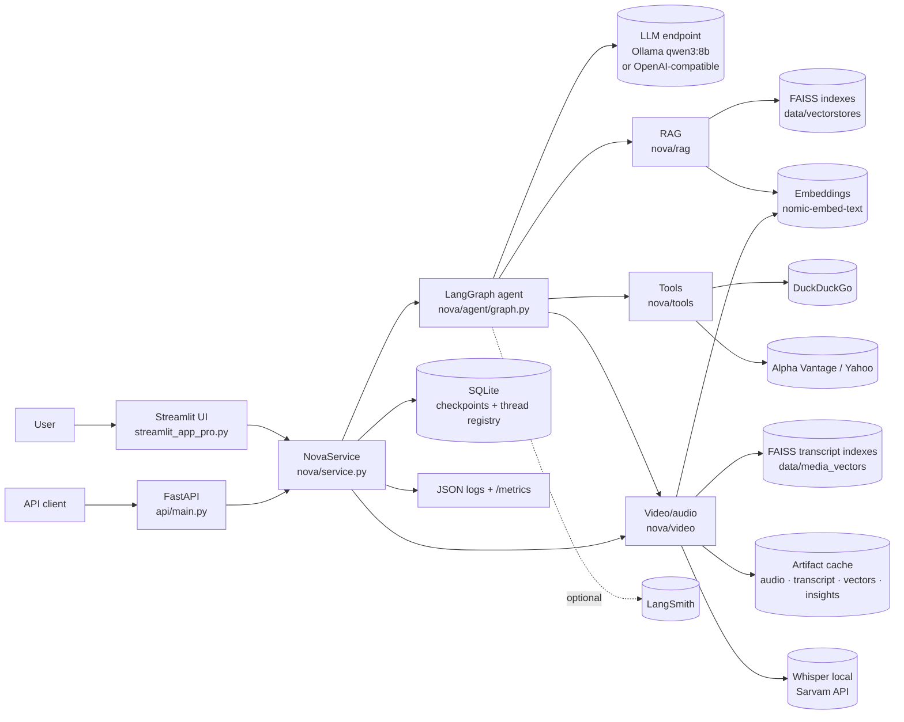

The UI and the API are thin transports. **Both call the same `NovaService`, which wraps the same compiled
graph.** No agent logic is duplicated between them.

## 2. LangGraph flow

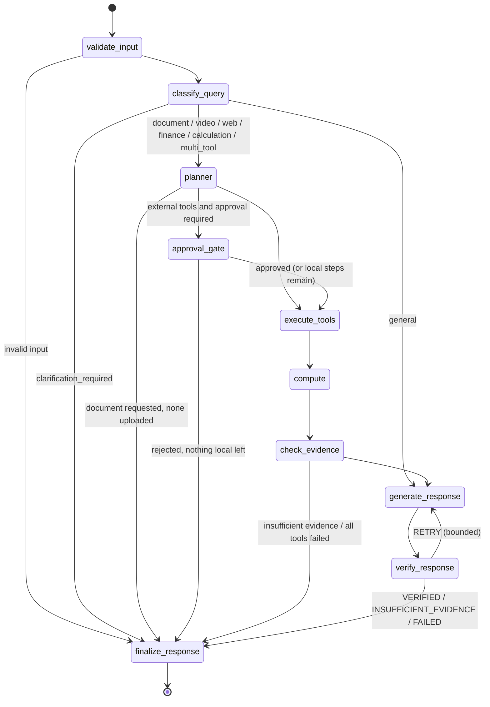

| Node | Calls the LLM? | Responsibility |
|---|---|---|
| `validate_input` | no | Normalise and size-check the message; reset per-turn state. |
| `classify_query` | only if ambiguous | Use rule fast paths, then structured output (`QueryClassification`), then policy guards and a retrieval probe. |
| `planner` | only for `multi_tool` | Build a deterministic plan from the classifier's entities, or a validated LLM plan (`Plan`). |
| `approval_gate` | no | Call LangGraph `interrupt()` with the external operations, then resume or prune them. |
| `execute_tools` | no | Run the plan in order with per-tool timeouts and normalised `ToolResult`s; document and **temporal video** retrieval, stored meeting insights; build the unified evidence registry. |
| `compute` | only if needed | Extract calculations from the evidence, reject invented numbers, run the AST calculator. |
| `check_evidence` | no | Apply the relevance gate, run corrective retrieval, score evidence, fall back gracefully when tools fail. |
| `generate_response` | yes, except pure arithmetic | Write a grounded answer that cites `[S#]`, `[W#]` and `[F#]` ids (streamed to the UI). |
| `verify_response` | no | Validate citations, check numbers, detect abstention, decide on a bounded retry. |
| `finalize_response` | no | Render the final answer and attach metadata (route, plan, tools, citations, timeline, latency, finance panels). |

## 3. RAG pipeline

```mermaid
flowchart LR
    PDF[PDF upload] --> V{validate<br/>type · size · pages}
    V --> P[parse pypdf]
    P --> CL[clean<br/>de-hyphenate · strip page furniture]
    CL --> CH[chunk per page<br/>600/100 chars]
    CH --> MD[metadata<br/>document_id · filename · page · chunk_id · injection flags]
    MD --> E[embed<br/>search_document: prefix]
    E --> IDX[(index.faiss + chunks.json<br/>+ manifest SHA-256)]
    Q[question] --> RW[rewrite<br/>classifier document_query]
    RW --> R[dense search<br/>raw + rewritten, merged]
    IDX --> R
    R --> RR[hybrid rerank<br/>0.75 cosine + 0.25 lexical]
    RR --> F{relevance ≥ 0.56?}
    F -- no --> CR[corrective keyword retrieval] --> F2{found?}
    F2 -- no --> INS[insufficient-evidence answer]
    F -- yes --> CTX[context assembly<br/>untrusted source blocks S1..S4]
    F2 -- yes --> CTX
    CTX --> GEN[grounded generation]
    GEN --> VER[citation + number verification]
    VER --> ANS[answer with validated page citations]
```

## 4. Memory architecture

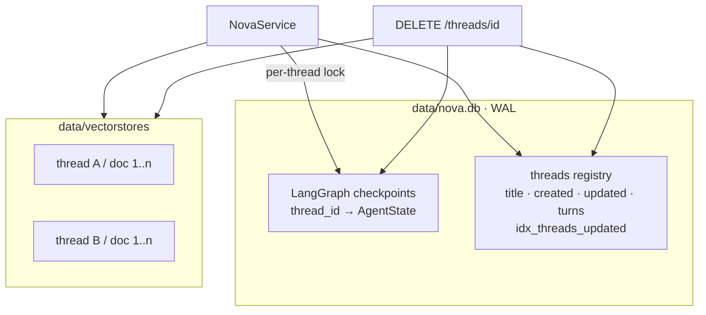

- **Conversation memory:** the `messages` list in the checkpoint, the only field that accumulates across turns.
  Before each LLM call it is filtered to plain user and assistant text and truncated
  (`NOVA_HISTORY_TURNS`, `NOVA_HISTORY_MESSAGE_CHARS`).
- **Per-turn working state:** plan, tool results, sources, verification and so on. `validate_input` resets it
  every turn, so nothing stale carries over.
- **Isolation:** checkpoints are keyed by `thread_id`, and vector indexes live under `<thread_id>/` with
  manifest ownership checks. The tests prove thread A cannot retrieve thread B's documents.
- **Restart persistence:** everything is on disk. The legacy `chatbot.db` is migrated once, without
  destroying it.

## 5. API architecture

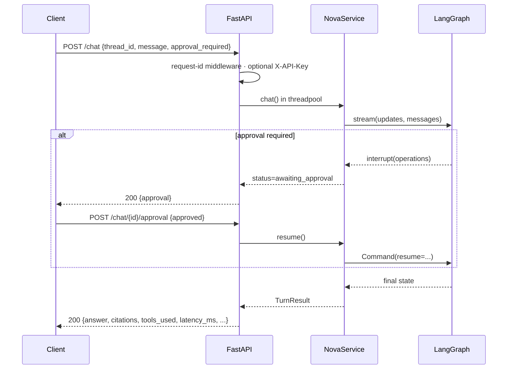

Errors are typed (`nova/errors.py`) and mapped to HTTP codes with safe messages: 401, 404, 409, 413, 415, 422
and 503. Tracebacks go to the logs only.

## 6. Deployment architecture

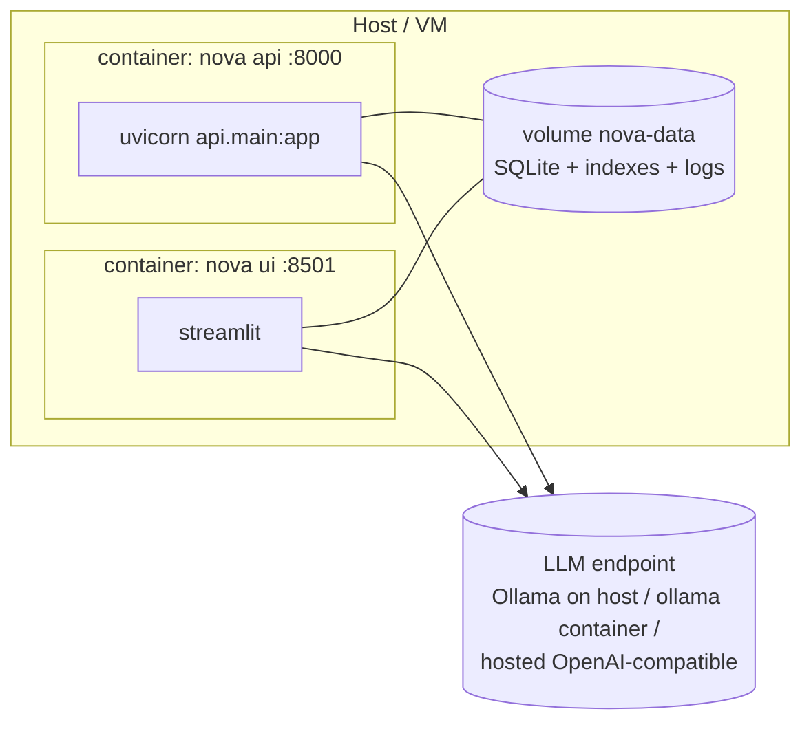

The application image never contains a model. The LLM endpoint is configuration (`OLLAMA_BASE_URL` or
`NOVA_LLM_PROVIDER=openai_compatible`). The `/health` (liveness) and `/ready` (LLM and database) endpoints
drive orchestration health checks.

## 7. Evaluation pipeline

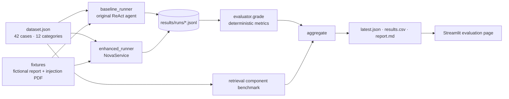

## 8. Video / audio ingestion

```mermaid
flowchart LR
    IN[upload MP4/MOV/AVI/MKV/WEBM/MP3/WAV<br/>· YouTube URL · SRT/VTT] --> V{validate<br/>extension · size · container probe · duration · URL allow-list}
    V --> Q[MediaAsset QUEUED<br/>SQLite media_assets]
    Q --> P[PROCESSING]
    P --> C1{cached transcript<br/>for this content + engine?}
    C1 -- yes --> SEG
    C1 -- no --> A[PyAV → 16 kHz mono WAV<br/>cached]
    A --> TR{language}
    TR -- english / auto --> W[Whisper<br/>faster-whisper default]
    TR -- hinglish --> SV[Sarvam STT-translate<br/>25 s pieces]
    W --> SEG[timestamped segments<br/>segment_id · start · end · text · language · speaker=null]
    SV --> SEG
    SEG --> CH[time-bounded chunks<br/>≤500 chars · ≤120 s · 1-segment overlap]
    CH --> EM[embeddings<br/>cached .npy]
    EM --> IX[(per-thread FAISS collection<br/>media_vectors/thread/media)]
    CH --> MI[meeting intelligence<br/>1 structured LLM pass per window]
    MI --> VF[verify items vs cited chunks<br/>drop unsupported · blank owners/deadlines]
    VF --> DONE[COMPLETED<br/>steps · timings · counts]
```

Every step updates `MediaAsset.steps` (`done` / `cached` / `skipped`) and the UI/API progress. A job
interrupted by a crash is marked FAILED on the next start. API processing runs in a FastAPI background task;
the design does not need a broker for a single node.

## 9. Temporal RAG

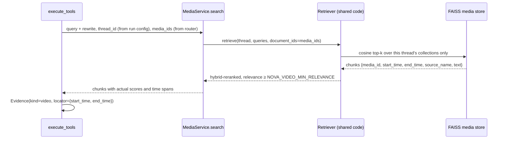

Timestamps are carried in chunk metadata from transcription to citation; nothing interpolates or guesses a
time. Retrieval scope: the store only loads collections whose manifest names the requesting thread; `media_id`
filters come from the router (filename match, "all meetings", or the conversation's active recording).

## 10. Cross-modal reasoning

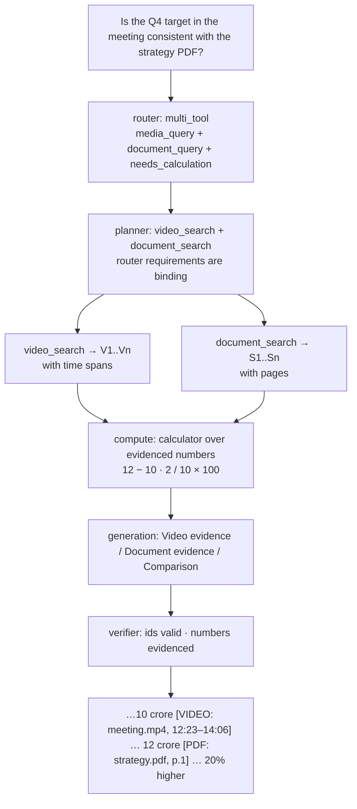

## 11. Unified evidence and citations

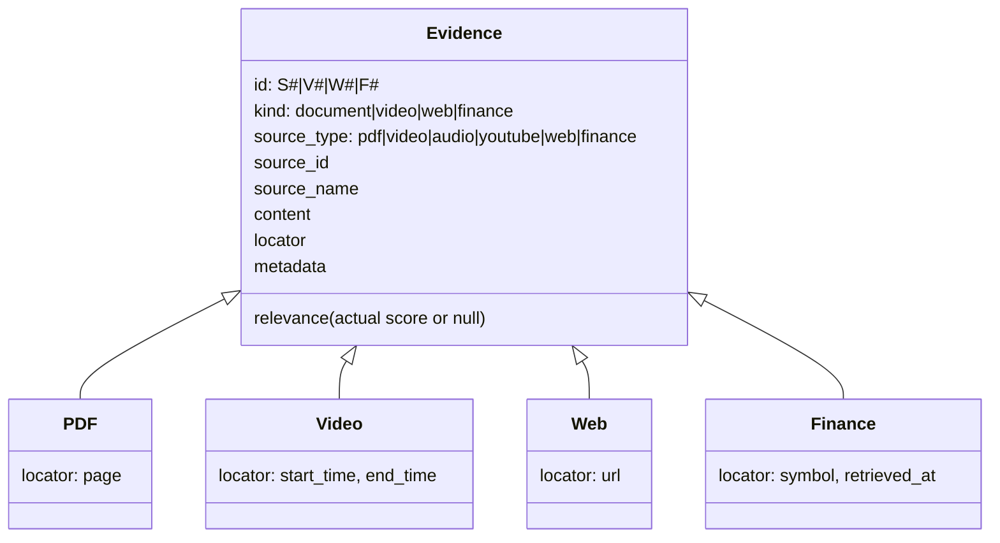

| Kind | Rendered citation (from the locator) |
|---|---|
| PDF | `[PDF: strategy_2026.pdf, p.1]` |
| Video / YouTube | `[VIDEO: quarterly_review_meeting.mp4, 12:23–14:06]` (H:MM:SS for ≥ 1 h) |
| Audio | `[AUDIO: vendor_call.mp3, 00:18–00:44]` |
| Web | `[WEB: [domain](url)]` |
| Finance | `[FINANCE: AAPL, Yahoo Finance, retrieved 2026-10-05T…]` |

## 12. Video evaluation

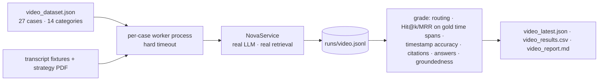
